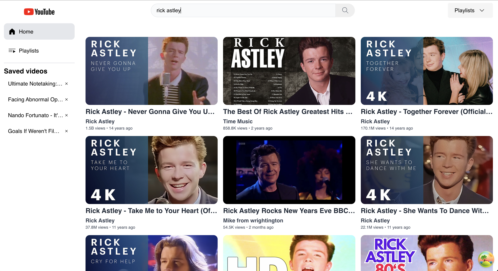

# Youtube player



## Table of Contents

    - [Introduction](#introduction)
    - [Stack](#stack)
    - [Installation](#installation)

## Introduction

Simple Youtube player presented as final project for the module "React Web" at [Harbour.Space](https://harbour.space/). It uses the Youtube API provided in class to fetch videos. It also supports playlists management and saved videos storage.

## Stack

- [React](https://reactjs.org/)
- [Vite](https://vitejs.dev/)
- [Styled Components](https://styled-components.com/)
- [React Query](https://react-query.tanstack.com/)
- [React Hook Form](https://react-hook-form.com/)

## Installation

```bash
# 1. Clone the repository
git clone

cd youtube-player

# 2. Install the dependencies (pnpm preferred, but npm or yarn will work as well)
pnpm install

# 3. Copy the .env.example file to .env
cp .env.example .env

# 4. Run the development server
pnpm dev
```
